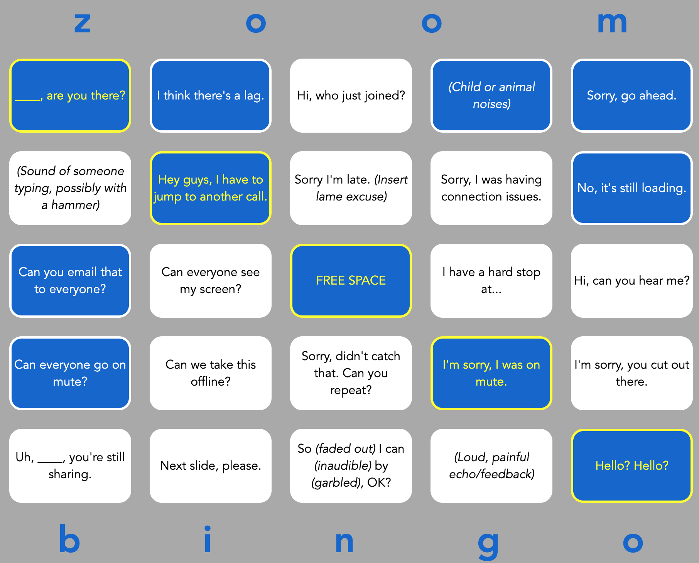

[](https://app.netlify.com/sites/zoom-bingo/deploys)

# video-bingo

## Description

Deployment: https://zoom-bingo.netlify.app/

Simple randomized bingo card filled with phrases you'll hear during your next unproductive Zoom call.

<div>

</div>

## Project setup

```
npm install
```

### Compiles and hot-reloads for development

```
npm run serve
```

### Compiles and minifies for production

```
npm run build
```
